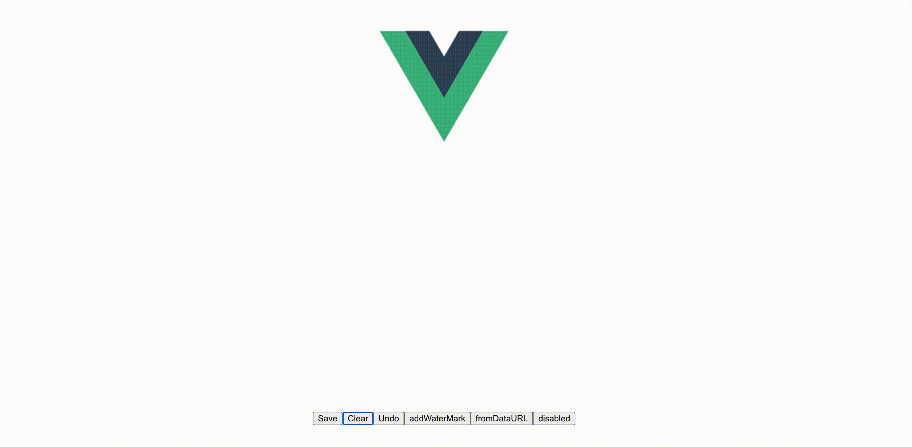

# vue3-signature

> A electronic signature component by Vue3.js



## Reference and Thanks
[signature_pad](https://github.com/szimek/signature_pad)


## API
---
#### Props
> w,h need units,like 100px or 100%

| name          |     type      |           default         |       description             |
|:-------------:|:-------------:|:-------------------------:|   :-----------------:         |
| sigOption     | `Object`     | {penColor:"rgb(0, 0, 0)", backgroundColor:"rgb(255,255,255)"} |     penColor, backgroundColor  |
|        w      | `String`      |         "100%"            |parent container width  |
|        h      | `String`      |         "100%"            |parent container height |
|  clearOnResize  | `Boolean`     |          false          |Canvas is cleared on window resize|
|  waterMark  | `Object`     |          {}          |check Usage addWaterMark |
|  disabled  | `Boolean`     |          false          |disabled |
|  defaultUrl  | `String`     |          ""          |you want show image by default |

#### Methods
| name              |  params                                       | description  |
| :-------------:   |:-------------:                                |:-------------:|
| save              | 			()/("image/jpeg")/("image/svg+xml") | save image as PNG/JPEG/SVG |
| clear             |                                   			| clear canvas |
| isEmpty           |                                   			| Returns true if canvas is empty, otherwise returns false |
| undo             |                                   			| remove the last dot or line |
| addWaterMark      |           {} // check Usage addWaterMark    | addWaterMark
| fromDataURL      |          (url)    | Draws signature image from data URL.


## Usage
---

``` 
npm install vue3-signature 
```

main.js
```vue3
import Vue3Signature from "vue3-signature"

createApp(App).use(Vue3Signature).mount("#app")
```

A.vue

```vue
<template>

  <Vue3Signature  ref="signature1" :sigOption="state.option" :w="'1280px'" :h="'400px'"
                 :disabled="state.disabled" class="example"></Vue3Signature>
  <button @click="save('image/jpeg')">Save</button>
  <button @click="clear">Clear</button>
  <button @click="undo">Undo</button>
  <button @click="addWaterMark">addWaterMark</button>
  <button @click="fromDataURL">fromDataURL</button>
  <button @click="handleDisabled">disabled</button>

</template>

<script setup>
import {reactive, ref} from 'vue'

const state = reactive({
  count: 0,
  option: {
    penColor: "rgb(0, 0, 0)",
    backgroundColor: "rgb(255,255,255)"
  },
  disabled: false
})

const signature1 = ref(null)

const save = (t) => {
  console.log(signature1.value.save(t))
}

const clear = () => {
  signature1.value.clear()
}

const undo = () => {
  signature1.value.undo();
}

const addWaterMark = () => {
  signature1.value.addWaterMark({
    text: "mark text",          // watermark text, > default ''
    font: "20px Arial",         // mark font, > default '20px sans-serif'
    style: 'all',               // fillText and strokeText,  'all'/'stroke'/'fill', > default 'fill
    fillStyle: "red",           // fillcolor, > default '#333'
    strokeStyle: "blue",	       // strokecolor, > default '#333'
    x: 100,                     // fill positionX, > default 20
    y: 200,                     // fill positionY, > default 20
    sx: 100,                    // stroke positionX, > default 40
    sy: 200                     // stroke positionY, > default 40
  });
}

const fromDataURL = (url) => {
  signature1.value.fromDataURL("https://avatars2.githubusercontent.com/u/17644818?s=460&v=4");
}

const handleDisabled = () => {
  state.disabled = !state.disabled
}

</script>

<style scoped>
.example{
  margin: 0 auto;
}
</style>

```
## For Vue2.x

[vue-signature](https://github.com/WangShayne/vue-signature)

## License
---
Released under the [MIT License](https://opensource.org/licenses/MIT).
